<!-- Find and Replace All [repo_name] -->
<!-- Replace [product-screenshot] [product-url] -->
<!-- Other Badgets https://naereen.github.io/badges/ -->

[![Contributors][contributors-shield]][contributors-url]
[![Forks][forks-shield]][forks-url]
[![Stargazers][stars-shield]][stars-url]


# Gas-Promotion-Smart-Contract

This project repository represents a pay-to-earn promotion where a gas station owner can offer their customers rewards through gasoline purchases. Rewards can be accumulated, exchanged for unique NFT art ("Oil stains”), or donated to a non-profit of their choice. The NFT’s are kept in the IPFS network - Infura. The administrator manages the promotion and the customer decides how to use their rewards.

---

# Table of Contents

- [Technologies and tools](#technologies-and-tools)
- [App flows](#app-flows)
- [Project structure](#project-structure)
- [Installation](#installation)
- [Demonstration of functionality](#demonstration-of-functionality)
- [Troubleshooting](#troubleshooting)
- [Contributors](#contributors)
- [License](#license)

---

## Technologies and tools

This project leverages the following tools, API and libraries:

- [Solidity ^0.6.6](https://docs.soliditylang.org/en/v0.8.13/) - programming language for implementing smart contracts.

- [Remix IDE](https://remix.ethereum.org) - Remix IDE allows developing, deploying and administering smart contracts for Ethereum like blockchains.

- [Ganache](https://trufflesuite.com/ganache/) - a personal Ethereum blockchain.

- [Metamask](https://metamask.io) - is a software cryptocurrency wallet.

- [Infura - IPFS Api](https://infura.io) - an IPFS network.

- [Streamlit](https://streamlit.io) - is an open-source app framework for Machine Learning and Data Science teams.

- [Web3.py](https://web3py.readthedocs.io/en/stable/) - is a Python library for interacting with Ethereum.

- [OpenZepplelin - ERC721](https://docs.openzeppelin.com/contracts/2.x/api/token/erc721) - set of interfaces, contracts, and utilities are all related to the ERC721 Non-Fungible Token Standard.

OpenZeppelin libraries:

```
ERC721 token:

import "https://github.com/OpenZeppelin/openzeppelin-contracts/blob/release-v3.0.0/contracts/token/ERC721/ERC721.sol"
```

---

## App flows

Simple:

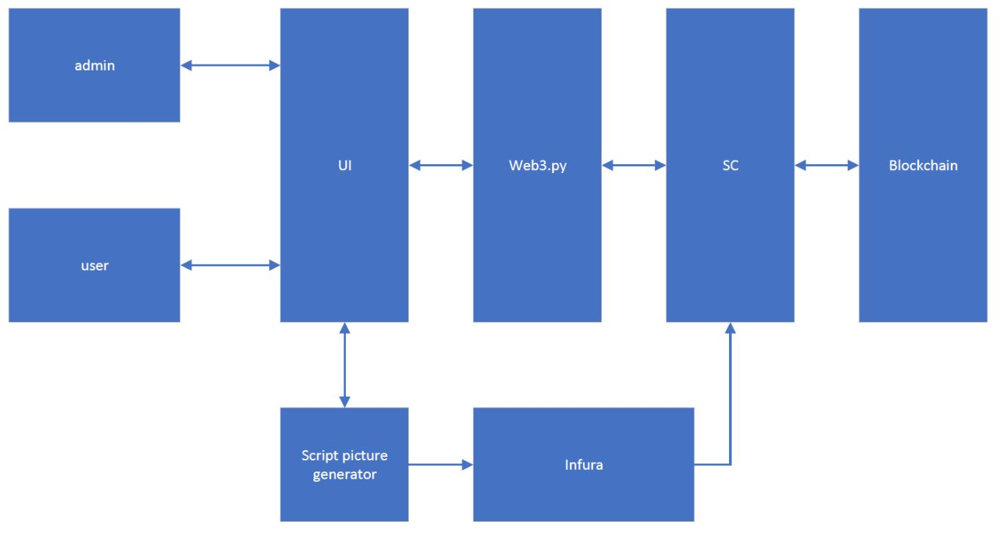

Detailed:

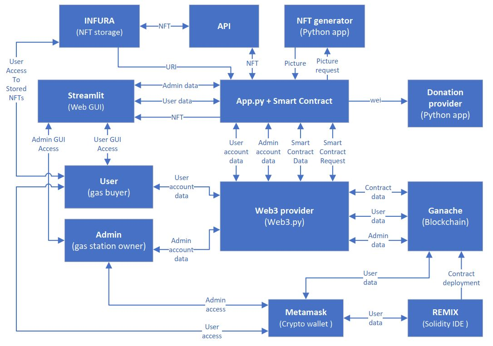

---

## Project structure

```
contracts/GasPromo.sol           - smart contract
contracts/compiled/compiled.json - ABI
Pictures                         - different pictures
infura.py                        - Infura API IPFS
random_pic.py                    - script for generating pictures
app.py                           - the main application that connects all the components together
SAMPLE.env                       - file contains description of important variables
LICENSE                          - MIT license
run.sh                           - bash script for running app
```

---

## Installation

1. Download and install [Metamask](https://metamask.io) crypto wallet.

2. Download and install [Ganache](https://trufflesuite.com/ganache/).

3. Configure the Ganache network in the Metamask.
   ```
   Network name: Ganache
   RPC: http://127.0.0.1:7545
   Chain ID: 1337
   Currency symbol: ETH
   ```
4. Import any account to the Metamask from the Ganache.

5. Copy smart contract (`contracts/GasPromo.sol`) to the [Remix IDE](https://remix.ethereum.org).

6. Compile (`compiler 0.6.12`), select `Injected Web3` as an environment and deploy the smart contract (confirm with the Metamask) to the Ganache network.

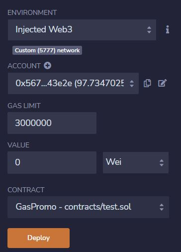

7. Fill out the `SAMPLE.env`:

   - provide `Infura` secret keys (you need to be registered here `https://infura.io`);

   - provide address of the deployed smart contract.

   ```
   INFURA_PROJECT_ID=<your infura project id>
   INFURA_PROJECT_SECRET=<your infura project secret key>
   WEB3_PROVIDER_URI=http://127.0.0.1:7545
   SMART_CONTRACT_ADDRESS=<deployed smart contract>
   ```

8. [Install](https://docs.streamlit.io/library/get-started/installation) Streamlit `pip install streamlit`.

9. Install `pip install randimage`

10. Run `./run.sh`

---

## Demonstration of functionality

### 1 Switch account to contract owner

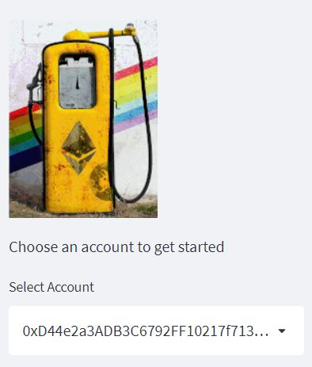

### 2 Stop promotion

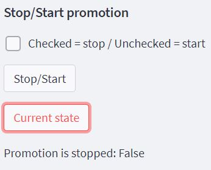

### 3 Mint bonus points

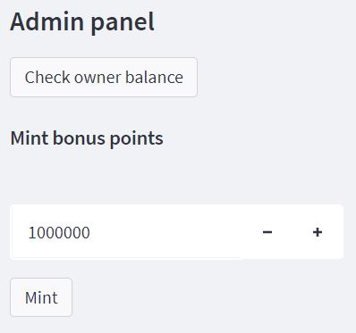

### 4 Set exchange rates for gas types

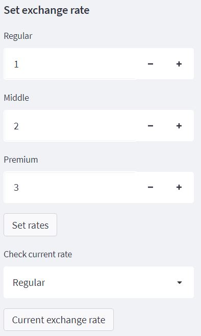

### 5 Set exchange rate for NFT

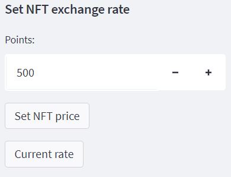

### 6 Run promotion (refer to step 2)

### 7 Switch account to any other account and join the promotion


### 8 Buy no less than 5 gallons of any gas

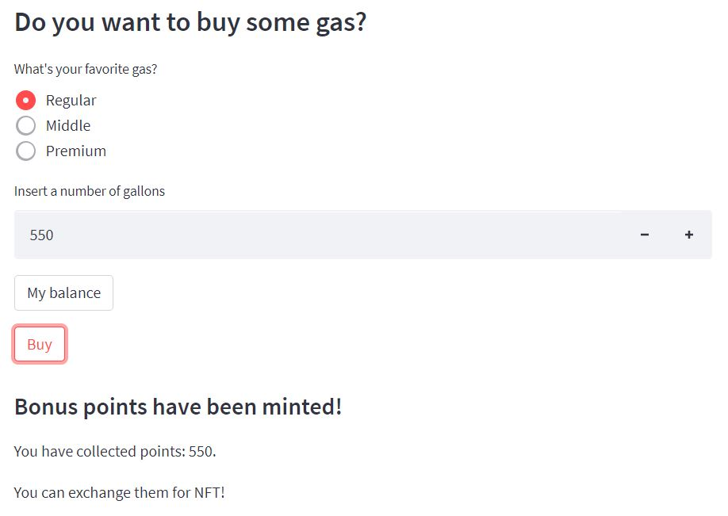

### 9 Try to donate

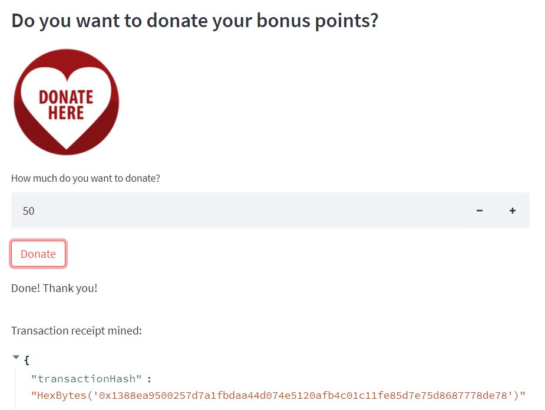

### 10 Mint NFT (Pls, be aware that you should have enougth balance. Pls refer to step 5)


### 11 Check your NFT collection

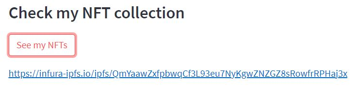

---

## Troubleshooting

**AttributeError: module ‘click’ has no attribute ‘get_os_args’**

Please install:

`pip install -U click==8`

---

## Contributors

Glupak Vladislav [Linkedin](https://www.linkedin.com/in/vladislav-glupak/)

Magdalena Švimberská [Linkedin](https://www.linkedin.com/in/magdalena-svimberska-8203128a/)

Thomas Brierton [Linkedin](https://www.linkedin.com/in/thomas-brierton-8961a6a1/)

Siddharth Venkumahanti [Linkedin](https://www.linkedin.com/in/siddharthvenkumahanti/)

<!-- MARKDOWN LINKS & IMAGES -->
<!-- https://www.markdownguide.org/basic-syntax/#reference-style-links -->

[contributors-shield]: https://img.shields.io/github/contributors/VladislavGlupak/Gas-Promotion-Smart-Contract.svg?style=for-the-badge
[contributors-url]: https://github.com/VladislavGlupak/Gas-Promotion-Smart-Contract/graphs/contributors
[forks-shield]: https://img.shields.io/github/forks/VladislavGlupak/Gas-Promotion-Smart-Contract.svg?style=for-the-badge
[forks-url]: https://github.com/VladislavGlupak/Gas-Promotion-Smart-Contract/network/members
[stars-shield]: https://img.shields.io/github/stars/VladislavGlupak/Gas-Promotion-Smart-Contract.svg?style=for-the-badge
[stars-url]: https://github.com/VladislavGlupak/Gas-Promotion-Smart-Contract/stargazers

## License

[](https://opensource.org/licenses/MIT)
